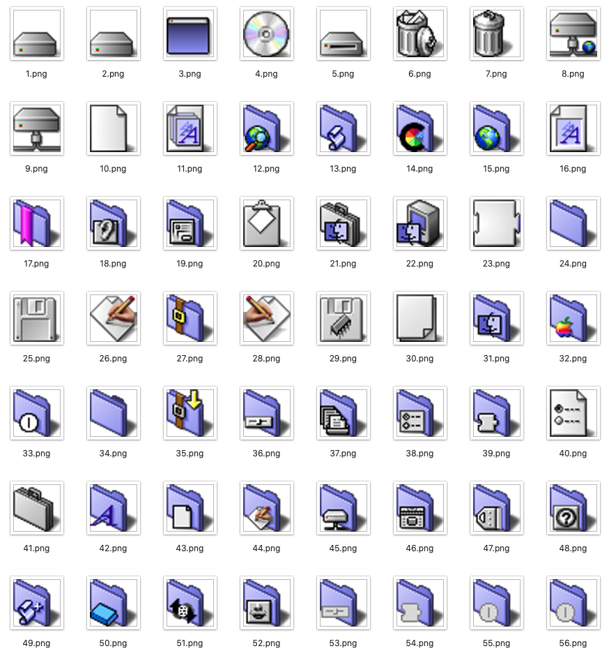
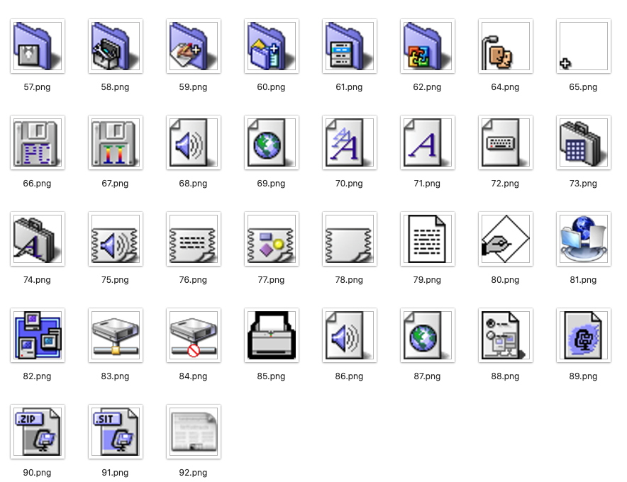

# MacOS9-icons
Classic Mac OS 9 resource icons

## About the resources

### 1. `rsrc`
   - Original .rsrc files extracted by [NazoraioiSkadinaujo (DeviantArt)](https://www.deviantart.com/nazoraioiskadinaujo/art/Mac-OS-9-icons-for-OSX-95225656).
   - It seems impossible to find an application that can open rsrc files nowadays.

### 2. `icns extracted_from_rsrc`
   - Binary data (containing icns) can be extracted from the rsrc file from the macOS resource fork `rsrc`.
   - The icns files are 260 bytes into the binary data.
   - The extraction can be carried out with the following Bash script:
   ```
   for filename in *.rsrc; do
       cp $filename/..namedfork/rsrc $filename.icns
       dd if=$filename.icns of=$filename.offset.icns bs=260 skip=1
   done
   ```
   - The latest MacOS Catalina seems to not like these icns files, saying that `It may be damaged or use a file format that Preview doesn’t recognise.`
   - As such, this does not work: `sips -s format png $filename.offset.icns --out $filename.png`

### 3. `png`
   - The icns files are converted to png with the online service [CoolUtils](https://www.coolutils.com/online/ICNS-to-PNG).
   - Size: 512x512
   
### 4. `png 64px`
   - `png` files downsized to 64x64 with Photoshop.

### 5. `icns fixed`
   - The png files are converted to valid icns files that Catalina is happy with.
   ```
   for filename in *.png; do
       mkdir $filename.iconset
       mv $filename $filename.iconset/icon_512x512.png
       iconutil -c icns $filename.iconset
   done
   ```

## Icons




(Yes, I know icon 63 is missing.)
